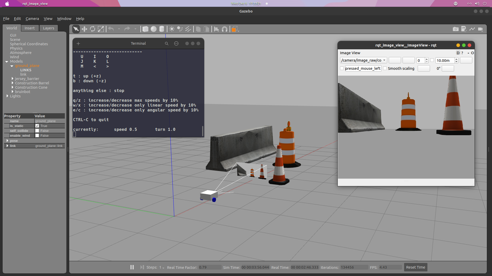

# a-ros

## BruinBot ROS Architecture
We use ROS2 Foxy on Ubuntu 20.04 LTS.



Dynamic Transforms:
```
sudo apt install ros-foxy-xacro ros-foxy-joint-state-publisher-gui
```

Compressed Images Plugin:
```
sudo apt install ros-foxy-image-transport-plugins
sudo apt install ros-foxy-rqt-image-view
```

Install ros2_control:
```
sudo apt install ros-foxy-ros2-control ros-foxy-ros2-controllers ros-foxy-gazebo-ros2-control
```

### Implement package to your robot hardware or developer PC

In your home directory (~), clone the repo:
```
mkdir robot_ws/src
cd src
git clone git@github.com:bruinbot/a-ros.git
```

Go back to your robot_ws directory, then source ROS2 Foxy and build ROS:
```
cd ../..
source /opt/ros/foxy/setup.bash
colcon build --symlink-install
```

While in your robot_ws, source the a-ros package and launch BruinBot simulator:
```
source install/setup.bash
ros2 launch a-ros bruinbot_sim.launch.py world:=./src/a-ros/worlds/obstacles.world
```

To tele-operate the robot:
```
ros2 run teleop_twist_keyboard teleop_twist_keyboard
```

Re-map tele-op to use ros2_control:
```
ros2 run teleop_twist_keyboard teleop_twist_keyboard --ros-args -r /cmd_vel:=/diff_cont/cmd_vel_unstamped
```

To open image view:
```
ros2 run rqt_image_view rqt_image_view
```

(Optional) Take compressed image that is being published by Gazebo and uncompress into new topic:
```
ros2 run image_transport republish compressed raw --ros-args -r in/compressed:=/camera/image_raw/compressed -r out:=/camera/image_raw/uncompressed
```