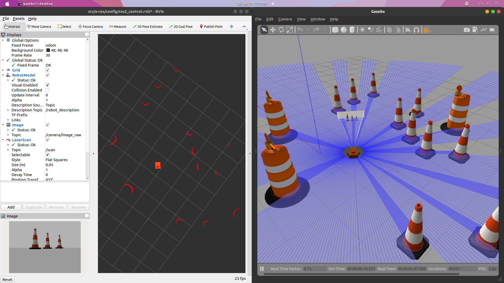
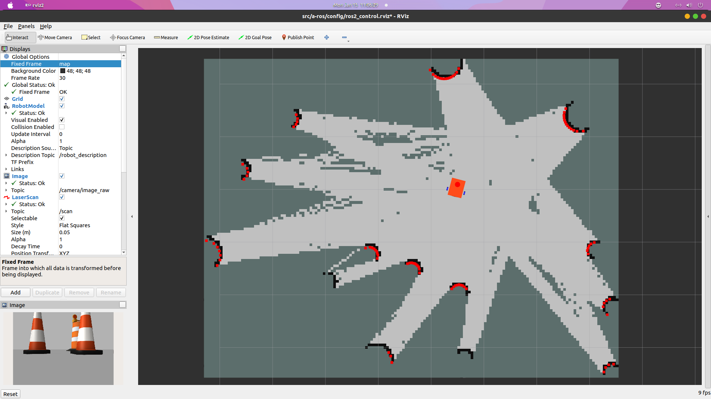
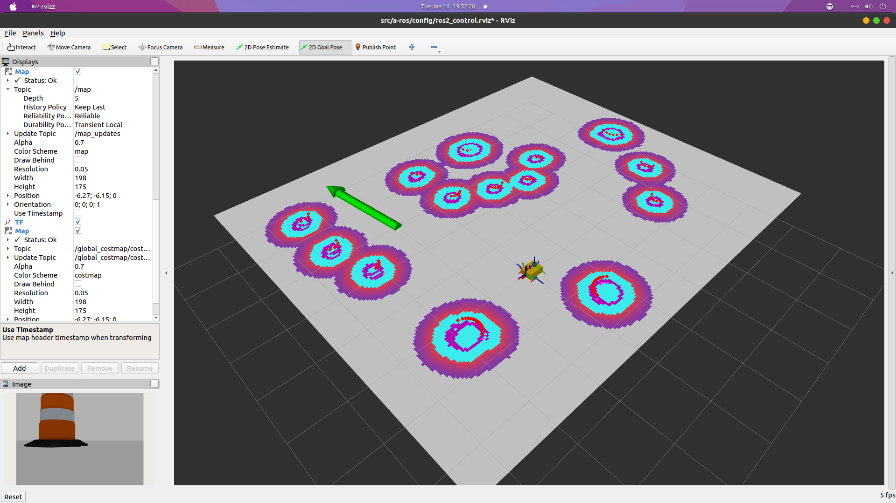
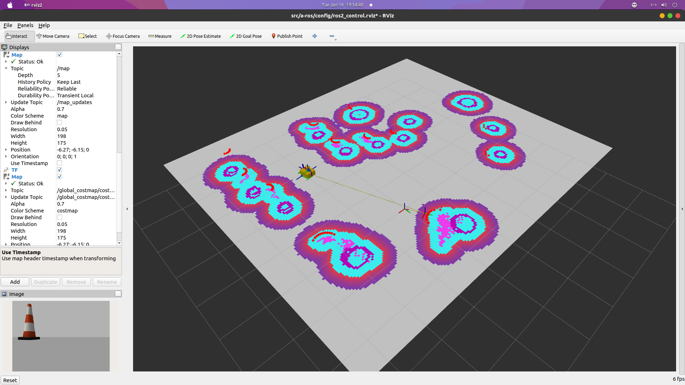

# a-ros

## BruinBot ROS Architecture
We use ROS2 Foxy on Ubuntu 20.04 LTS.







Dynamic Transforms:
```
sudo apt install ros-foxy-xacro ros-foxy-joint-state-publisher-gui
```

Compressed Images Plugin:
```
sudo apt install ros-foxy-image-transport-plugins
sudo apt install ros-foxy-rqt-image-view
```

Install ros2_control:
```
sudo apt install ros-foxy-ros2-control ros-foxy-ros2-controllers ros-foxy-gazebo-ros2-control
```
Install slam_toolbox (we will use online asynchronous):
```
sudo apt install ros-foxy-slam-toolbox
```

Install nav2:
```
sudo apt install ros-foxy-navigation2 ros-foxy-nav2-bringup ros-foxy-turtlebot3*
sudo apt install ros-foxy-twist-mux
```

### Implement package to your robot hardware or developer PC

In your home directory (~), clone the repo:
```
mkdir robot_ws/src
cd src
git clone git@github.com:bruinbot/a-ros.git
```

Go back to your robot_ws directory, then source ROS2 Foxy and build ROS:
```
cd ../..
source /opt/ros/foxy/setup.bash
colcon build --symlink-install
```

While in your robot_ws, source the a-ros package and launch BruinBot simulator:
```
source install/setup.bash
ros2 launch a-ros bruinbot_sim.launch.py world:=./src/a-ros/worlds/obstacles.world
```

### Use new terminals for the following commands. Remember to source both foxy and the a-ros package.

To tele-operate the robot:
```
ros2 run teleop_twist_keyboard teleop_twist_keyboard
```

Re-map tele-op to use ros2_control:
```
ros2 run teleop_twist_keyboard teleop_twist_keyboard --ros-args -r /cmd_vel:=/diff_cont/cmd_vel_unstamped
```

Run rviz2 with camera and lidar:
```
rviz2 -d src/a-ros/config/ros2_control.rviz 
```

To open image view:
```
ros2 run rqt_image_view rqt_image_view
```

(Optional) Take compressed image that is being published by Gazebo and uncompress into new topic:
```
ros2 run image_transport republish compressed raw --ros-args -r in/compressed:=/camera/image_raw/compressed -r out:=/camera/image_raw/uncompressed
```

### Gamepad Controller
Send inputs to dev machine and send to physical robot.

Install joystick driver to Ubuntu:
```
sudo apt install joystick jstest-gtk evtest
```
Test your gamepad:
```
evtest
```
Check devices and run joystick node:
```
ros2 run joy joy_enumerate_devices
ros2 run joy joy_node
```
Open new terminal and echo to check if ROS picks up joystick:
```
ros2 topic echo /joy
ros2 param list
ros2 run joy_tester test_joy
```
Launch joystick:
ros2 launch a-ros joystick.launch.py

### 2D SLAM (slam_toolbox) Online Async

Copy online async slam_toolbox into our config directory. Run this command from home directory (~):
```
cp /opt/ros/foxy/share/slam_toolbox/config/mapper_params_online_async.yaml dev_ws/src/a-ros/config
```

Launch slam_toolbox:
```
ros2 launch slam_toolbox online_async_launch.py  params_file:=./src/a-ros/config/mapper_params_online_async.yaml use_sim_time:=true
```
On rviz2, create a Map and set topic to /map

Save generated map (as you drive around), and then set the mapper_params_online_async.yaml `mode = localization` and uncomment the map file path and map_start_at_doc lines
Here we saved the map name as `map_save`.

### Adaptive Monte Carlo Localization (AMCL):

Note -- this is part of the nav2 stack
```
ros2 run nav2_map_server map_server --ros-args -p yaml_filename:=map_save.yaml -p use_sim_time:=true
```
And on new terminal, run lifecycle_bringup on map_server:
```
ros2 run nav2_util lifecycle_bringup map_server
```
On rviz2:
Map -> Topic -> Durability Policy = Transient Local

Run AMCL to localize our robot against the map:
```
ros2 run nav2_amcl amcl --ros-args -p use_sim_time:=true
```
Use the lifecycle_bringup terminal and put it on amcl instead:
```
ros2 run nav2_util lifecycle_bringup amcl
```
Then in rviz2, click on `2D Pose Estimate` and drag and drop the arrow where your robot is currently located and facing at

### Navigation2 (Nav2)

Controller publishes to: /diff_cont/cmd_vel_unstamped

Nav2 publishes to: /cmd_vel

We multiplex the /cmd_vel_joy from teleop_node and /cmd_vel from nav2 into twist_mux node and publish it to /cmd_vel_out (but we will remap this to /diff_cont/cmd_vel_unstamped and add to launch file):
```
ros2 run twist_mux twist_mux --ros-args --params-file ./src/a-ros/config/twist_mux.yaml -r cmd_vel_out:=diff_cont/cmd_vel_unstamped
```

Launch nav2:
```
ros2 launch nav2_bringup navigation_launch.py use_sim_time:=true
```
Localization with AMCL:
```
ros2 launch nav2_bringup localization_launch.py map:=./map_save.yaml use_sim_time:=true
```
Set Initial Pose, Durability Policy = Transient Local
```
ros2 launch nav2_bringup navigation_launch.py use_sim_time:=true map_subscript_transient_local:=true
```

Files from nav2 copied to this repository, so can use these commands instead on actual robot:
```
ros2 launch a-ros bruinbot_localization_launch.py map:=./map_save.yaml use_sim_time:=true
ros2 launch a-ros bruinbot_navigation_launch.py use_sim_time:=true map_subscript_transient_local:=true
```

### Ball Tracker
https://github.com/joshnewans/ball_tracker
```
ros2 launch a-ros bruinbot_ball_tracker.launch.py sim_mode:=true
ros2 topic echo /detected_ball
```